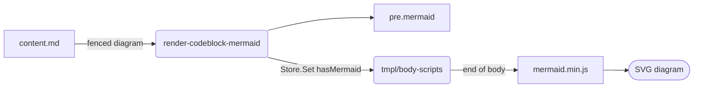
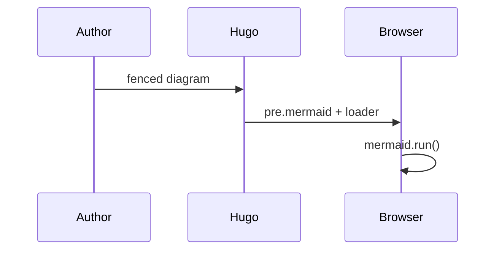

Fence a diagram with `mermaid` and it renders. The library loads only on pages that
contain one, and follows the theme toggle.

A second diagram on the same page shares the one library load.

## Opting out

`mermaid.enable: false` in `params.yaml` suppresses the loader.
`mermaid.version` pins a different release; the default is 11.6.0.
